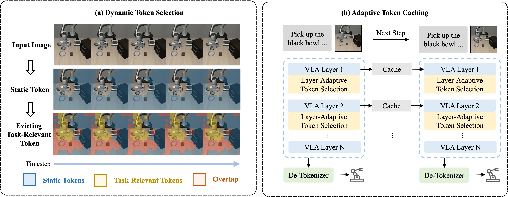

# <div align="center">VLA-Cache: Towards Efficient Vision-Language-Action Model via Adaptive Token Caching in Robotic Manipulation</div>

<div align="center">

[](https://vla-cache.github.io/) [](https://arxiv.org/abs/2502.02175) [](LICENSE)

**Siyu Xu, Yunke Wang, Chenghao Xia, Dihao Zhu, Tao Huang, Chang Xu**

</div>

<div align="center">
  <strong>🔥 VLA-Cache is a training-free, plug-and-play solution for accelerating vision-language-action models.</strong>
</div>

---

## 📌 News
🔥 **[2025/09/18]** Our VLA-Cache is accepted by **NeurIPS 2025**!

🔥 **[2025/06/12]**: Code for OpenVLA is available ([OpenVLA README](src/openvla/README_VLA_Cache.md)).

🔥 **[2025/05/29]**: Code for OpenVLA-OFT is released ([OpenVLA-OFT README](src/openvla-oft/README_VLA_Cache.md)).

---

## 🎯 Overview

Vision-Language-Action (VLA) models can map multi-modal inputs (vision + language) to actions for robotic tasks in an end-to-end manner. However, due to the high frame rate and spatial complexity in robotic control, VLA inference can be computationally expensive.

**VLA-Cache** introduces a lightweight and effective caching mechanism by detecting unchanged visual tokens between frames and reusing their key-value computations. This leads to substantial speed-up with minimal accuracy loss.

<p align='center'>

</p>

---

## 🛠️ Installation

### 1. Clone the repository
```bash
git clone https://github.com/siyuhsu/vla-cache.git
cd vla-cache
```

### 2. Set up environments
Follow the [OpenVLA](src/openvla/README.md) and [OpenVLA-OFT](src/openvla-oft/README.md) setup instructions.

#### For OpenVLA:
```bash
conda activate openvla
cd src/openvla
pip install -e .
```

#### For OpenVLA-OFT:
```bash
conda activate openvla-oft
cd src/openvla-oft
pip install -e .
```

---

## 🚀 VLA-Cache Evaluation

### <a name="openvla-evaluation"></a>🔧 OpenVLA Evaluation

#### ✅ Download pretrained checkpoint:
```bash
conda activate openvla
cd src/openvla
python vla_cache_scripts/download_model_local.py \
  --model_id openvla/openvla-7b-finetuned-libero-spatial
```

#### ▶️ Run evaluation with VLA-Cache:
```bash
python experiments/robot/libero/run_libero_eval.py \
  --pretrained_checkpoint checkpoints/openvla-7b-finetuned-libero-spatial \
  --task_suite_name libero_spatial \
  --use_vla_cache True
```

#### ❌ Run baseline without VLA-Cache:
```bash
python experiments/robot/libero/run_libero_eval.py \
  --pretrained_checkpoint checkpoints/openvla-7b-finetuned-libero-spatial \
  --task_suite_name libero_spatial \
  --use_vla_cache False
```

---

### <a name="openvla-oft-evaluation"></a>🔧 OpenVLA-OFT Evaluation

#### ✅ Download pretrained checkpoint:
```bash
conda activate openvla-oft
cd src/openvla-oft
python vla_cache_scripts/download_model_local.py \
  --model_id moojink/openvla-7b-oft-finetuned-libero-spatial
```

#### ▶️ Run evaluation with VLA-Cache:
```bash
python experiments/robot/libero/run_libero_eval.py \
  --pretrained_checkpoint checkpoints/openvla-7b-oft-finetuned-libero-spatial \
  --task_suite_name libero_spatial \
  --use_vla_cache True
```

#### ❌ Run baseline without VLA-Cache:
```bash
python experiments/robot/libero/run_libero_eval.py \
  --pretrained_checkpoint checkpoints/openvla-7b-oft-finetuned-libero-spatial \
  --task_suite_name libero_spatial \
  --use_vla_cache False
```

---

## 📖 Citation

If you find this work useful, please cite:
```bibtex
@article{xu2025vla,
  title={VLA-Cache: Towards Efficient Vision-Language-Action Model via Adaptive Token Caching in Robotic Manipulation},
  author={Xu, Siyu and Wang, Yunke and Xia, Chenghao and Zhu, Dihao and Huang, Tao and Xu, Chang},
  journal={arXiv preprint arXiv:2502.02175},
  year={2025}
}
```

---

## 🤝 Acknowledgements

We build on the amazing work of [OpenVLA](https://github.com/openvla/openvla), [OpenVLA-OFT](https://github.com/moojink/OpenVLA-OFT), and [Huggingface Transformers](https://github.com/huggingface/transformers).

---

## 📜 License

This project is licensed under the [Apache 2.0 License](LICENSE).
